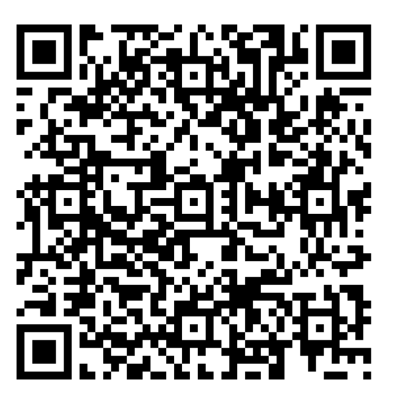

# 📡 Meshtastic-Notfallanleitung (Deutsch)

Diese Anleitung hilft dir, **schnell und einfach** dein Meshtastic-Gerät (Node) mit deinem Smartphone zu verbinden und mit anderen zu kommunizieren – auch **ohne Mobilfunk oder Internet**.

## 🧾 Vorbereitung: Was du brauchst

* Ein Meshtastic Gerät mit Antenne
* Ein Smartphone (Android oder iPhone)
* Die **Meshtastic-App** (kostenlos im App Store oder Play Store)

## 🔌 Vorbereitung: App installieren

1. Öffne den **Google Play Store** oder **Apple App Store**.
2. Suche nach **"Meshtastic"**.
3. Lade die App herunter und installiere sie.

## 🔗 Vorbereitung: Mit dem Node verbinden (Pairing)

1. Schalte Bluetooth am Handy ein.
2. Öffne die Meshtastic-App und wechsele zum letzten Reiter/Tab
3. Dort siehst du alle Geräte mit den du dich schon mal Verbunden hast oder neu verbinden könntest.
4. Das Gerät sucht automatisch nach Nodes in der Umgebung.
5. Wähle deinen Node aus ____________________________ (Name z. B. `meshtastic-XXXX`).
6. Bestätige die Verbindung, wenn gefragt wird. Eventuell muss noch ein Code für das Pairing eingegeben werden. Der Code lautet ____________________________

## 🗨️ Notfallsituation: Nachrichten lesen und senden

1. In dem linken Reiter (Symbol Sprechblase) werden Nachrichten geschrieben und empfangen.
2. Es gibt 2 öffentliche Gruppenchats: "ShortSlow" für den Allgemeiner Chat, sowie "MeshHessen" als Community Chat.
3. Es gibt 1 privaten Gruppenchat. Der Name ist ____________________________
4. Dieser Bereich kann in etwa wie WhatsApp oder Signal benutzt werden

> [!IMPORTANT]
> Es kann etwas dauern bis eine Nachricht geschickt oder empfangen wird. Das Senden kann auch fehlschlagen und der Sendestatus wird als kleines Symbol an der Nachricht angezeigt.

Die Nachricht wird **über Funk** an alle erreichbaren Nodes in deiner Umgebung gesendet – **auch ohne Internet**.

## Probleme: Der "ShortSlow" Gruppenchat ist nicht sichtbar, nur "LongFast".

1. Gehe in die Einstellungen über den Reiter mit dem Zahnrad am unteren Rand
2. Unter "Lora" stelle sicher, dass die Region auf "European Union 868MHz" und Presets auf "Short Range - Slow" steht.

## Probleme: Der "MeshHessen" Gruppenchat ist nicht sichtbar

1. Scanne folgenden QR Code und folge den Anweisungen:

